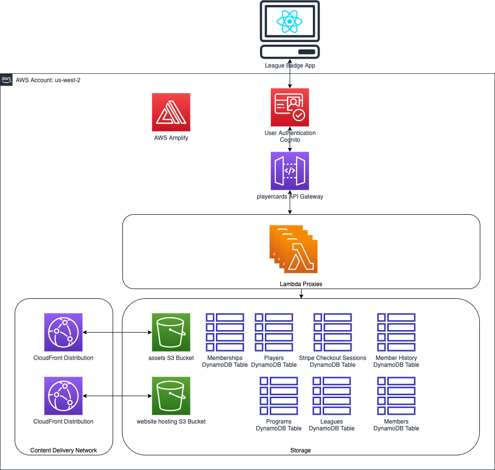
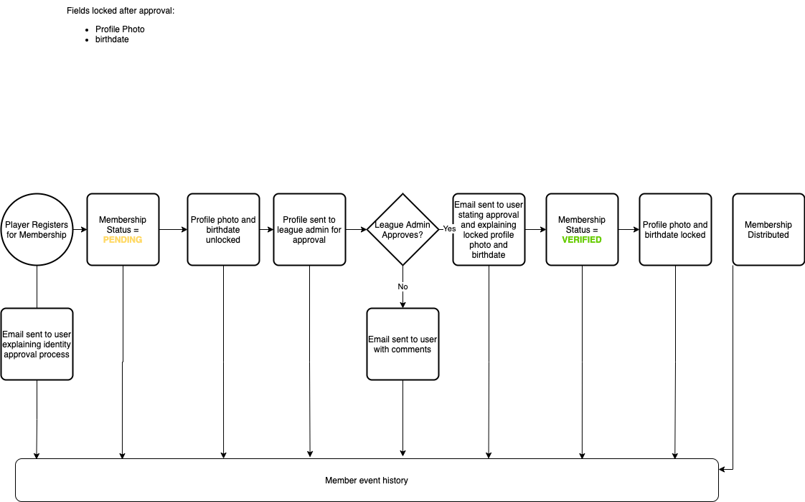
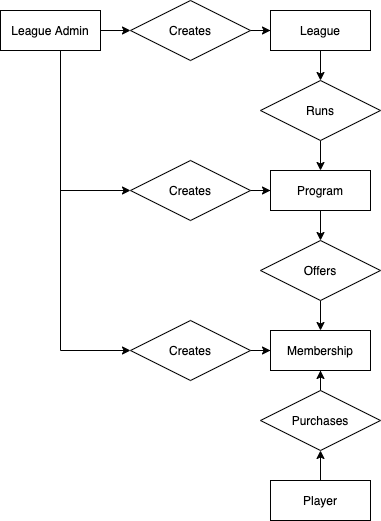
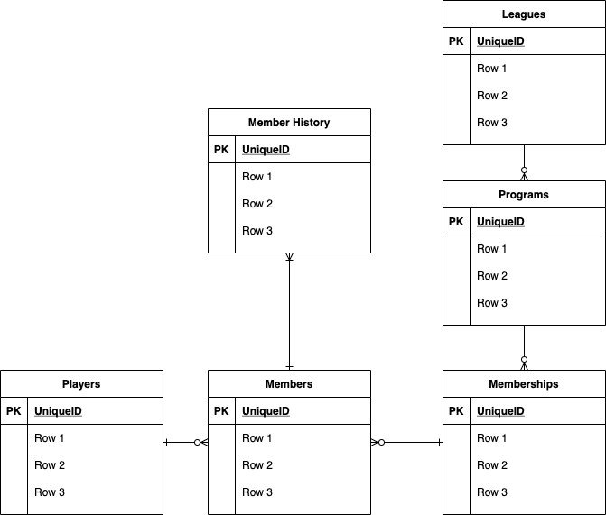

# League Badge: A Digital Player Card and Player Registration Platform

## Reporting Bugs/Feature Requests

## Prerequisites
    1. Create SSM param for stripe secret key
    2. create SSM param for webhook signing secret

## Deploy steps:
    1. Delete `team-provider-info.json` from the `amplify` folder
    2. Delete `aws-exports.js` from `src` folder
    3. Run `amplify init` in this directory
    4. Delete the existing hosting bucket - should be suffixed with `hosting` or something.
    5. Delete the existing playercardsverification bucket
    6. run `amplify push`
    7. run `amplify publish`
    8. Update the cloudfront origin to point to the new bucket
       1. Add new origin and update bucket restriction to new OAI
       2. Update origin behavior to use new origin
       3. Delete old origin
       4. Can take up to an hour for the CDN to fully refresh
    9. Enable CORS on all API Gateway lambda proxies and re-deploy the API
       1. Enabled logging if needed
    10. Update Stripe WebHook URL to use new API Gateway URL: https://dashboard.stripe.com/test/webhooks/
       2. Should be: `[api gateway invokeurl]/pay/stripe/checkoutcompleted`

## Changes to make after deployment
* Allow for S3 object tagging
* * Update the leagueadminsGroupRole leagueadmins-group-s3-policy to allow `s3:PutObjectTagging`
* * Update the amplify-playercards-dev-221236-authRole protected_policy to allow `s3:PutObjectTagging`
* * create the S3 lifecycle for the tag `governmentid=true`

   
## AWS Architecture

## League Badge is a multi-tenant microservice
All users of this platform are sharing the same storage resources, and their access to these resources are governed through each user's permissions. When onboarding new users or league administrators, no extra infrastructure is required, save any regional GDPR/CCPA restrictions that would force you to.

Right now this solution is deployed in the US-West-2 region in AWS.

## Profile Approval Flow
A repeatable process that allows the league control over the quality of player photos while also allowing for self-service information updates by the player (so staff doesn't have to do it).

This process would apply to the following player attributes: profile photo, first name, last name, and birthdate.

Once a profile has been VERIFIED, these fields will be locked until next renewal or registration. Profile unlock will occur when the renewal window begins for the membership they've purchased, as configured by the league admin.
The profile approval status would remain in PENDING until a league admin approves of their profile, during which time the player will always need to present their drivers license to the ref in order to play.

## Entity Model

## Table Relationships
Attributes not complete yet.

## Date Formats
I've made extensive use of the Python [`datetime`](https://docs.python.org/3/library/datetime.html) library to format dates.
This is the format we use to store in dynamo db: `'%Y%m%d%H%M%S.%f'`. 
The character-for-character version of this format is: `YYYYmmddHHMMSS.ffffff`
This results in a reliable, *fixed-length* decimal number like so like so: `20210528054242.249826`
This allows us to create sort keys in Dynamo, and also convert to and from any timezone or date format that is needed.

All of these datetime values are converted to reflect UTC time before persisting, and must be accounted for when fetching as well.
You will often see this to add the UTC timezone to make a timezone-aware datetime object: `dt.strptime(str(date_number) + '+0000', from_format + '%z')`
For more information on date formatting, you can find all of the format codes here: https://docs.python.org/3/library/datetime.html#strftime-and-strptime-format-codes

**Timezones are not accounted for in our web application at this time.**

## Troubleshooting

### Bloated lambda function sizes
Sometimes Amplify will suck in too many virtual environment libraries when it builds the function. This happens when I create a jupyter notebook inside the function folder. This can create functions as big as 40 mb (thanks to `jupyter`) and impact your ability to upload to s3 before timing out, and also costs more money to run a larger lambda in the long run.

To fix this, launch a virtual environment inside the function folder, and delete all of the libraries in the virtual environment as so:
1. `pipenv shell`
2. `pip freeze > requirements.txt` You should see a bunch of extra libraries in this file that you don't need for your function.
3. `pip uninstall -r requirements.txt -y`
4. `sudo rm requirements.txt`

Amplify will rebuild your function dependencies next time you `amplify push`, and should result in a much smaller size (~2 MB)

### The role defined for the function cannot be assumed by Lambda
If you see this error in your api gateway logs, you'll need to edit the function's role and click save without actually editing anything. This somehow refreshes the permissions.